### Top level T32 instruction set encoding

* MCU如何区分16-bit和32-bit指令？
  * 如果半字的[15:11]是下面的编码，则是32-bit指令，否则位16-bit指令
    * 0b11101
    * 0b11110
    * 0b11111

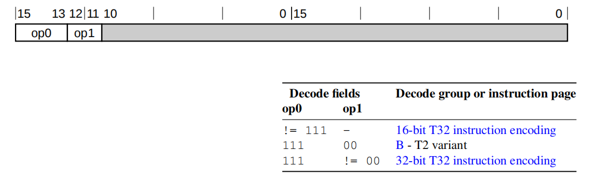

### 16-bit T32 instruction encoding

#### Shift (immediate), add, subtract, move, and compare

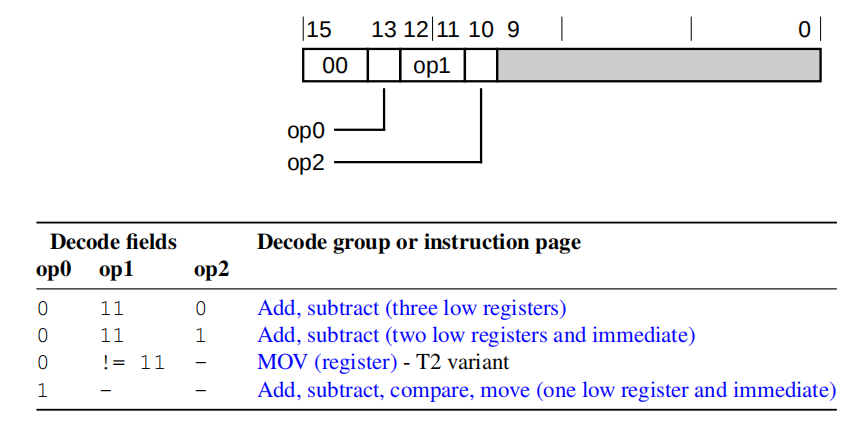

##### Add, subtract (three low registers)

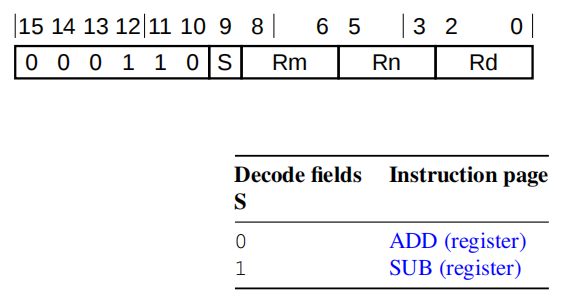

##### Add, subtract (two low registers and immediate)

##### Add, subtract, compare, move (one low register and immediate)

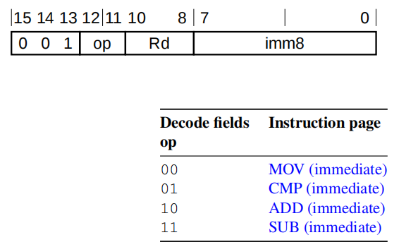

#### Data-processing (two low registers)

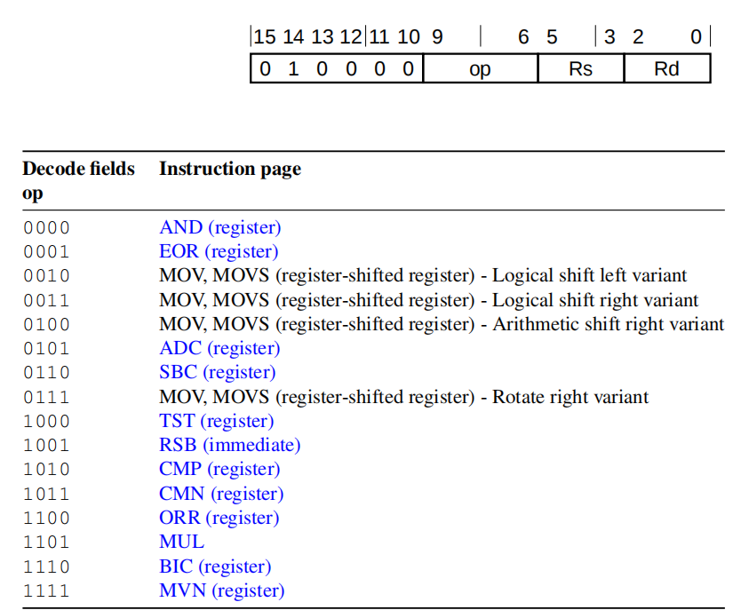

#### Special data instructions and branch and exchange

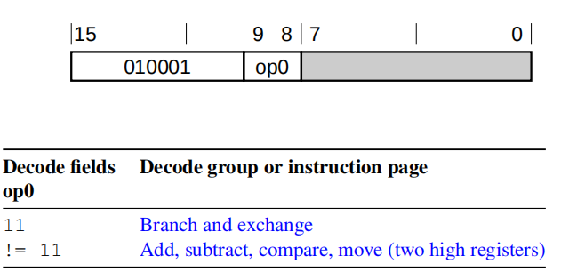

##### Branch and exchange

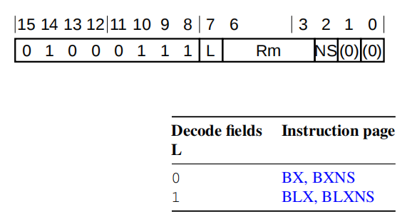

##### Add, subtract, compare, move (two high registers)

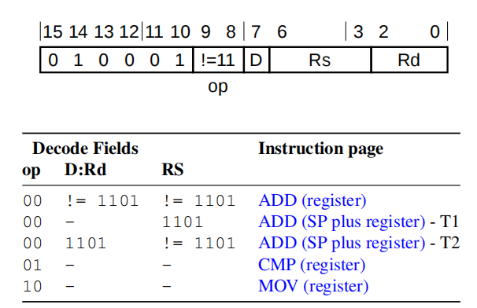

#### Load/store

##### Load/store (register offset)

##### Load/store word/byte (immediate offset)

##### Load/store halfword (immediate offset)

##### Load/store (SP-relative)

##### Load/store multiple

#### Add PC/SP (immediate)

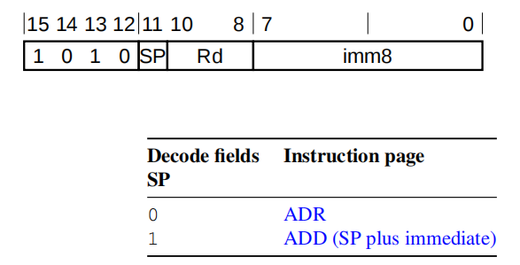

#### Miscellaneous 16-bit instructions

##### Adjust SP (immediate)

##### Extend

##### Reverse bytes

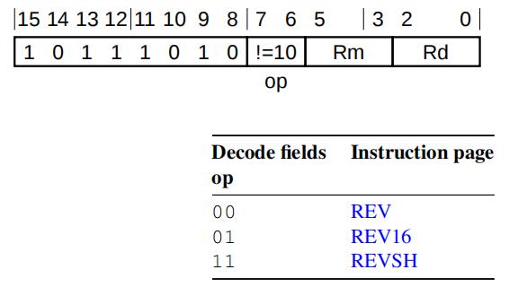

##### Hints

##### Push and Pop

#### Conditional branch, and Supervisor Call

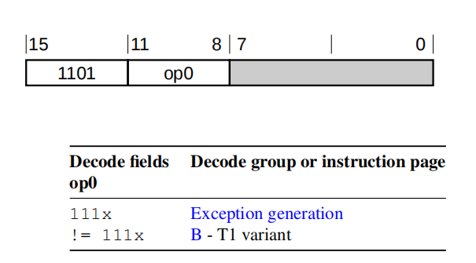

##### Exception generation

### 32-bit T32 instruction encoding

