[Mermaid 实用教程](https://blog.csdn.net/fenghuizhidao/article/details/79440583)
[官网](https://mermaidjs.github.io/)
[Github](https://github.com/knsv/mermaid)

[mermaid在线编辑](https://mermaid.live/edit#pako:eNpVkE1qw0AMha8itEohvoAXhcZOsgmk0Ow8WQiPnBmS-WEsU4Ltu3ccU2i1kt77nhAasQ2ascRbomjgUisPuT6ayiTbi6P-CkXxPh1ZwAXPzwl2m2OA3oQYrb-9rfxugaAaTwvGIMb6-7xa1St_9jxB3ZwoSojXv87lO0ywb-ynyev_OyZxTh2ajsqOipYSVJReCG7RcXJkdT59XBSFYtixwjK3mjsaHqJQ-TmjQ9QkvNdWQsJS0sBbpEHC19O3v_PK1JbyI9wqzj8k-lxH)

### [甘特图](https://mermaid-js.github.io/mermaid/#/gantt)

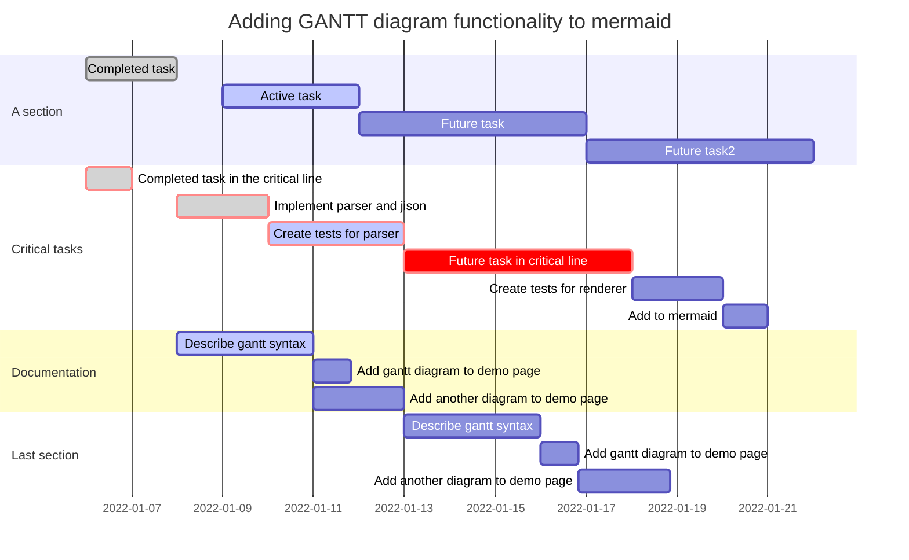

```mermaid
gantt 
dateFormat HH:mm
axisFormat %H:%M
Initial milestone : milestone, m1, 17:49,2min
taska2 : 10min
taska3 : 5min 
Final milestone : milestone, m2, 18:14, 2min
```

### 序列图

##### 语法

```
sequenceDiagram
    [参与者1][消息线][参与者2]:消息体
    ...
```

例如:

```
sequenceDiagram
    张三->>李四: 吃了吗？
    李四->>张三: 吃了
```

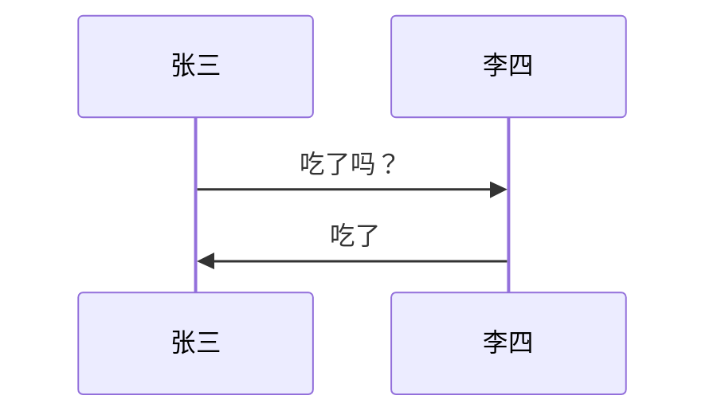

###### 参与者

上例中的张三、李四都是参与者，上例中的语法是最简单的，也可以明显表明参与者有哪些

```
sequenceDiagram
    participant 参与者 1
    participant 参与者 2
    ...
    participant 简称 as 参与者 3 #该语法可以在接下来的描述中使用简称来代替参与者 3
```

###### 消息线

| 类型 | 描述                       |
| ---- | -------------------------- |
| ->   | 无箭头的实线               |
| -->  | 无箭头的虚线               |
| ->>  | 有箭头的实线               |
| -->> | 有箭头的虚线               |
| -x   | 末端为叉的实线（表示异步） |
| --x  | 末端为叉的虚线（表示异步） |

###### 处理中

在消息线末尾增加 + ，则消息接收者进入当前消息的“处理中”状态；
在消息线末尾增加 - ，则消息接收者离开当前消息的“处理中”状态。

或者使用以下语法直接说明某个参与者进入“处理中”状态
``activate 参与者``

###### 标注

语法如下
``Note 位置表述 参与者: 标注文字``

其中位置表述可以为

| 表述     | 含义                       |
| -------- | -------------------------- |
| right of | 右侧                       |
| left of  | 左侧                       |
| over     | 在当中，可以横跨多个参与者 |

###### 循环

语法如下

```
loop 循环的条件
    循环体描述语句
end
```

###### 判断

```
alt 条件 1 描述
    分支 1 描述语句
else 条件 2 描述 # else 分支可选
    分支 2 描述语句
else ...
    ...
end
```

如果遇到可选的情况，即没有 else 分支的情况，使用如下语法：

```
opt 条件描述
    分支描述语句
end
```

##### 举个例子

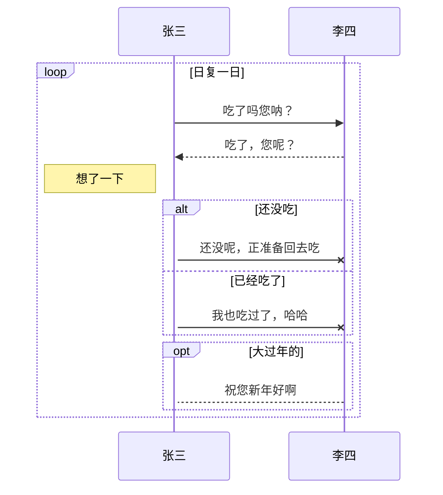

### 流程图

##### 语法

```
graph 方向描述
    图表中的其他语句...
```

其中“方向描述”为

| 用词 | 含义     |
| ---- | -------- |
| TB   | 从上到下 |
| BT   | 从下到上 |
| RL   | 从右到左 |
| LR   | 从左到右 |

###### 节点定义

即流程图中每个文本块，包括开始、结束、处理、判断等。Mermaid 中每个节点都有一个 id，以及节点的文字。

| 表述       | 说明           |
| ---------- | -------------- |
| id[文字]   | 矩形节点       |
| id(文字)   | 圆角矩形节点   |
| id((文字)) | 圆形节点       |
| id>文字]   | 右向旗帜状节点 |
| id{文字}   | 菱形节点       |

需要注意的是，如果节点的文字中包含标点符号，需要时用双引号包裹起来。
另外如果希望在文字中使用换行，请使用
替换换行

###### 节点间的连线

| 表述	    说明 |                |
| ------------- | -------------- |
| >             | 添加尾部箭头   |
| -             | 不添加尾部箭头 |
| --            | 单线           |
| --text--      | 单线上加文字   |
| ==            | 粗线           |
| ==text==      | 粗线加文字     |
| -.-           | 虚线           |
| -.text.-      | 虚线加文字     |

###### 子图表

使用以下语法添加子图表

```
subgraph 子图表名称
    子图表中的描述语句...
end
```

###### 对 fontawesome 的支持

使用 ``fa: #图表名称# ``的语法添加 fontawesome。

##### 举个例子

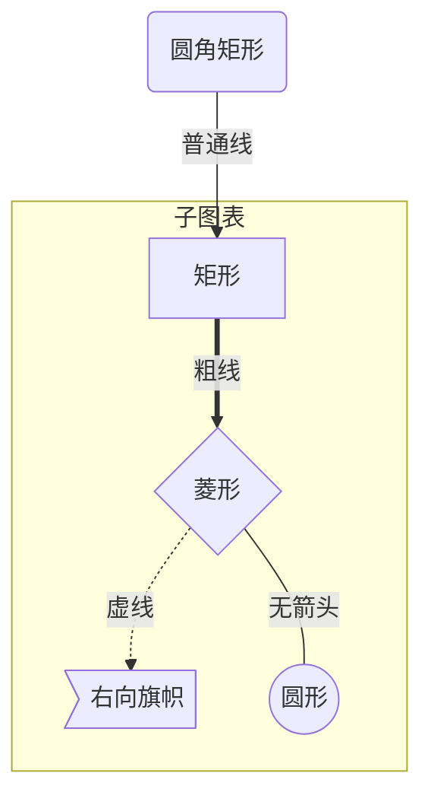

### 类图

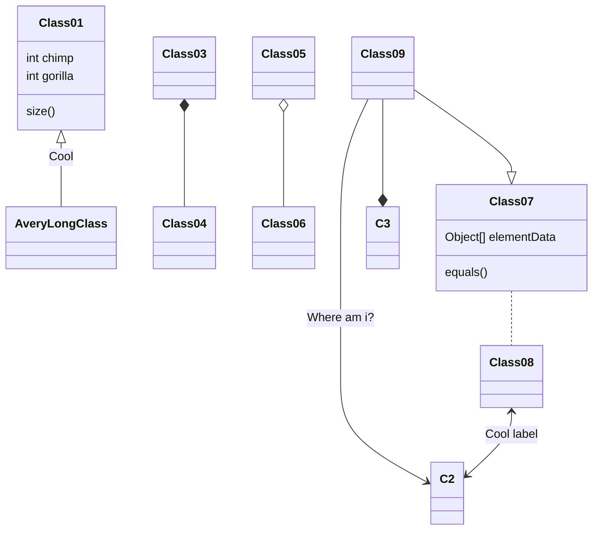

### [State diagrams](https://mermaid-js.github.io/mermaid/#/stateDiagram?id=state-diagrams)

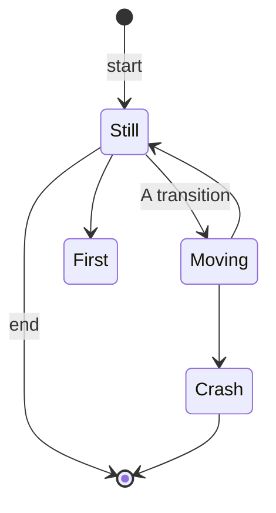

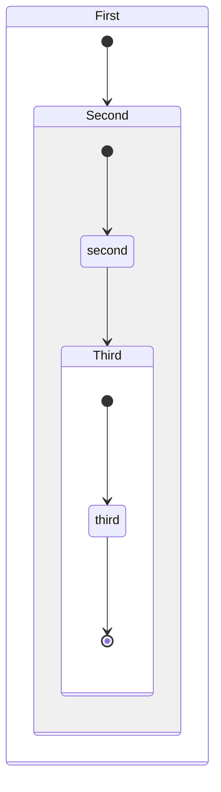

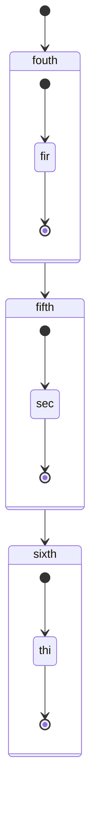

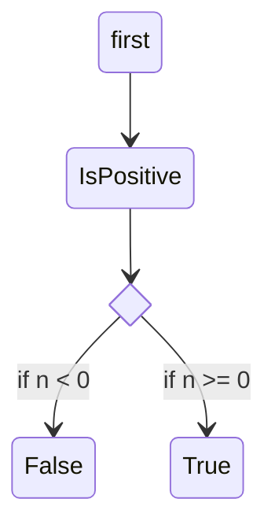

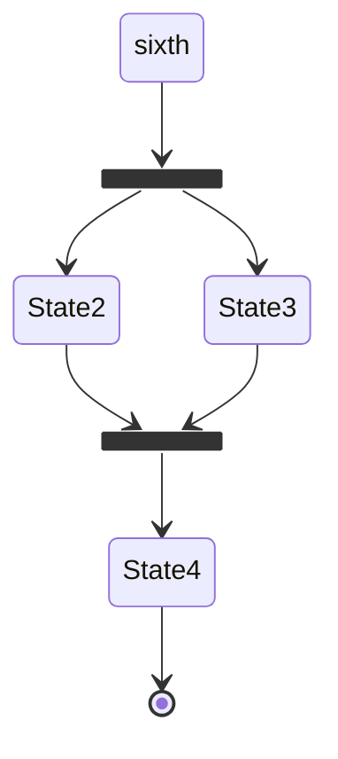

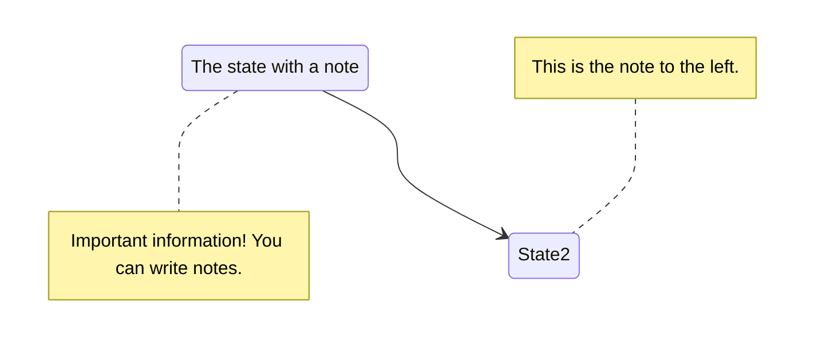
