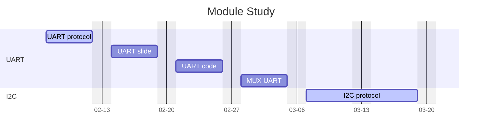

1. 掌握以下module能作为backup解issue，达到和owner相当水平

   1. UART/I2C/PWM/RTC/SDIO/cache/flash/dma/irrx/isink/LED/wdt/lowpower/logging/systeminit/memorylayout/exception/~~nvic/gpio/eint/spi/ept/key/mux~~
   2. 
2. 每天半小时学习
3. 2.7 先从uart开始

