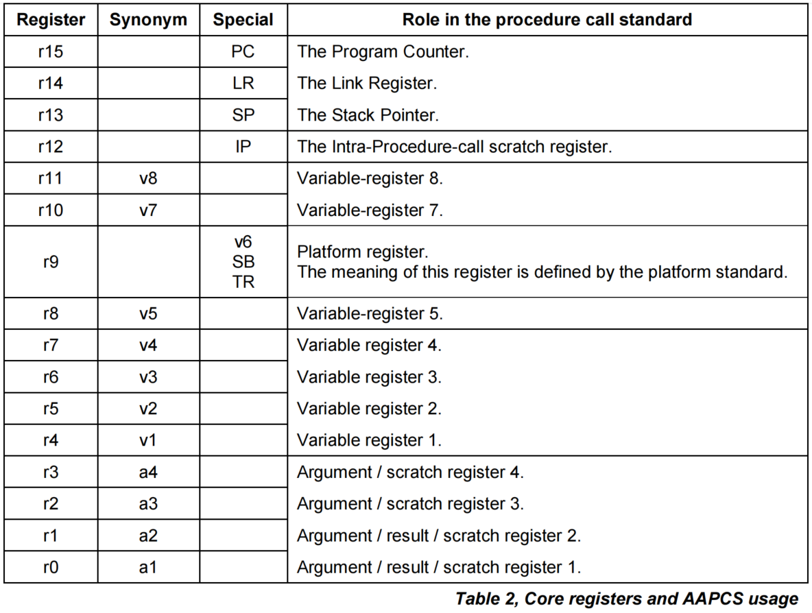

### Core Registers

* r0~r3 用来传递参数到子程序和从函数返回结果;也可用来在routine 中保存中间值

* 寄存器r12(IP)可以被链接器用作routine与其调用的任何subroutine之间的scratch 寄存器.它也可以在routine中用来保持subroutine调用之间的中间值

* r4-r8, r10 and r11 (v1-v5, v7 and v8) 用来保存routine的局部变量. 只有v1-v4可以被整个Thumb指令集统一使用，但AAPCS不要求Thumb代码只使用这些寄存器.
* 一个subroutine必须保存r4-r8、r10、r11和SP的内容(以及PCS变体中的r9，指定r9为v6)。
* 在过程调用标准的所有变体中，寄存器r12-r15具有特殊的角色。在这些角色中，它们被标记为IP、SP、LR和PC。

### Universal stack constraints
* Stack_limit < SP <= stack_base
* SP mod 4 = 0,通常要求SP mod 8 = 0.
* 进程只能访问（用来读取或写）由[SP，stack_base-1]分隔的整个堆栈的闭合间隔（其中SP是寄存器r13的值）。

### Subroutine Calls
