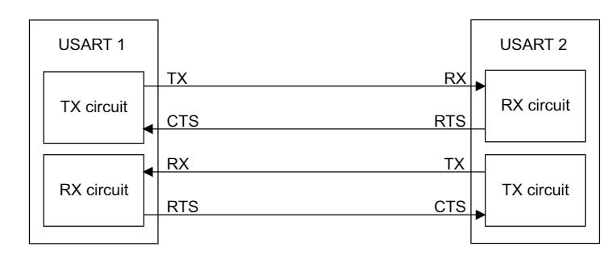

### Hardware flow control between 2 USARTs

* CTS is input
  * If CTS is asserted (tied low), then the next data is transmitted , else the transmission does not occur
* RTS is output
  * RTS is pulled to low, as long as the USART receiver is ready to receive a new data.
  * RTS is pulled to high, when the receive register is full, indicating that the transmission is expected to stop at the end of the current frame.

