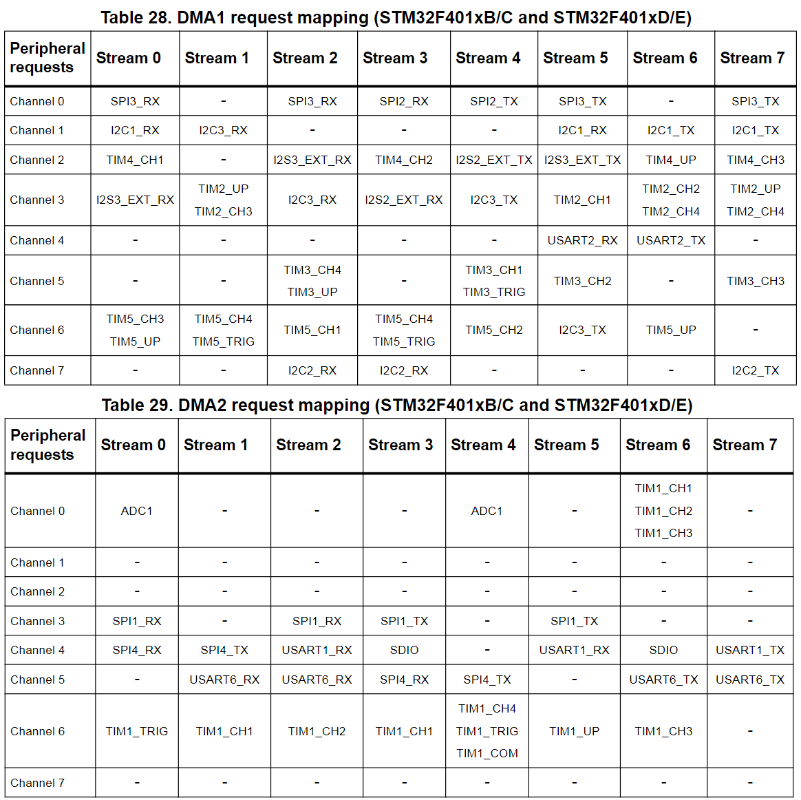
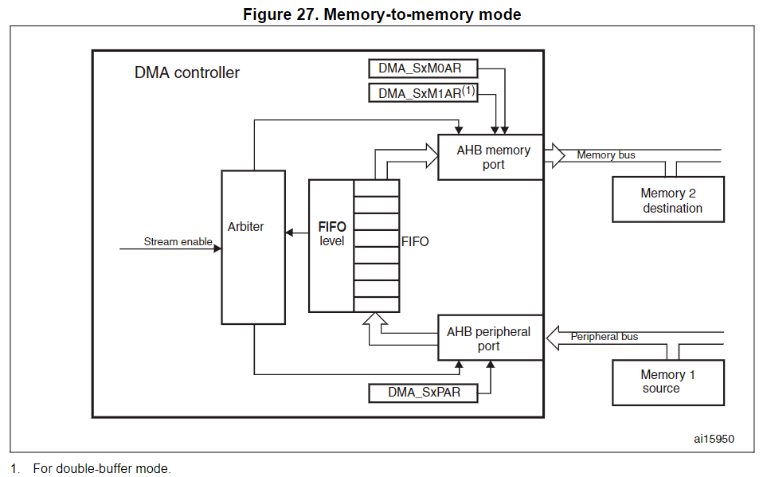

# STM32 DMA

## ar

## DMA main features

* Dual AHB master bus architecture, one dedicated to memory accesses and one dedicated to peripheral accesses
* AHB slave programming interface supporting only 32-bit accesses
* 8 streams for each DMA controller, up to 8 channels (requests) per stream
* Four-word depth 32 first-in, first-out memory buffers (FIFOs) per stream, that can be used in FIFO mode or direct mode:

  * FIFO mode
    * with threshold level software selectable between 1/4, 1/2 or 3/4 of the FIFO size
  * Direct mode
    * Each DMA request immediately initiates a transfer from/to the memory. When it is configured in direct mode (FIFO disabled), to transfer data in memory-to-peripheral mode, the DMA preloads only one data from the memory to the internal FIFO to ensure an immediate data transfer as soon as a DMA request is triggered by a peripheral.
* Each stream can be configured by hardware to be:

  * a regular channel that supports peripheral-to-memory, memory-to-peripheral and memory-to-memory transfers
  * a double buffer channel that also supports double buffering on the memory side
* Each of the 8 streams are connected to dedicated hardware DMA channels (requests)
* Priorities between DMA stream requests are software-programmable (4 levels consisting of very high, high, medium, low) or hardware in case of equality (request 0 has priority over request 1, etc.)
* **Each stream also supports software trigger for memory-to-memory transfers (only available for the DMA2 controller)**
* Each stream request can be selected among up to 8 possible channel requests. This selection is software-configurable and allows several peripherals to initiate DMA requests
* The number of data items to be transferred can be managed either by the DMA controller or by the peripheral:

  * DMA flow controller: the number of data items to be transferred is software-programmable from 1 to 65535
  * Peripheral flow controller: the number of data items to be transferred is unknown and controlled by the source or the destination peripheral that signals the end of the transfer by hardware
* Independent source and destination transfer width (byte, half-word, word): when the data widths of the source and destination are not equal, the DMA automatically packs/unpacks the necessary transfers to optimize the bandwidth. This feature is only available in FIFO mode
* Incrementing or non-incrementing addressing for source and destination
* Supports incremental burst transfers of 4, 8 or 16 beats. The size of the burst is software-configurable, usually equal to half the FIFO size of the peripheral
* Each stream supports circular buffer management
* 5 event flags (DMA Half Transfer, DMA Transfer complete, DMA Transfer Error, DMA FIFO Error, Direct Mode Error) logically ORed together in a single interrupt request for each stream

## DMA transactions

数据传输的长度

数据的位宽

每个DMA 传输包含3部分:

* **数据加载**的外设寄存器地址、内存地址，通过DMA_SxPAR 或者 DMA_SxM0AR寻址
* **数据存储**的外设寄存器地址、内存地址，通过DMA_SxPAR 或者 DMA_SxM0AR寻址
* A post-decrement of the DMA_SxNDTR register, which contains the number of transactions that still have to be performed

## Channel selection

每个Stream有8个channel可选，每个stream和每个channel固定为某个外设使用，不同的chip连接可能不一样

DMA_SxCR.CHSEL[2:0] 用于选择使用哪个channel

## Arbiter

根据DMA stream优先级，Arbiter 分别管理2个AHB master port(memory 和peripheral port)的8个DMA stream请求

优先级管理有两个阶段：

* Software:
  有下面4个level的 优先级可以在DMA_SxCR 寄存器中配置
  * Very high priority
  * High priority
  * Medium priority
  * Low priority
* Hardware
  两个优先级相同的stream，其优先级有Steam 号低的优先级较高，比如Stream 0和Stream 1优先级都为High，那实际上，Stream 0优先级比Stream 1优先级高

## DMA streams

8个DMA控制器流中的每一个都在源和目标之间提供单向传输链路

每个Stream可以配置为：

* Regular type transactions:
  * 内存到外设
  * 外设到内存
  * 内存到内存
* Double-buffer type transactions
  * 使用两个内存 指针
    * 当DMA正在读或写一个buffer的时候,应用可以读或写另一个buffer

最长可一次性传世65535个bytes

## Source, destination and transfer modes

源和目的传输都可以访问整个4G内存空间

DMA_SxCR.DIR[1:0] 控制传输方向:

* M2P, P2M,M2M

DMA_SxCR.PSIZE 和 DMA_SxCR.MSIZE配置数据宽度为半字;=p;=8;	A,相应的,DMA_SxPAR or DMA_SxM0AR/M1AR 寄存器配置的地址也要相应对齐到前面配置的数据宽度上

### Peripheral-to-memory mode

通过DMA_SxCR.EN=1使能,每当外设发出传输请求,Stream就发起一次从外设到fifo的传输.当达到FIFO的 threshold,FIFO的数据就会被Drained 并且存入目的地址.

The transfer stops once the DMA_SxNDTR register reaches zero, when the peripheral requests the end of transfers (in case of a peripheral flow controller) or when the EN bit in the DMA_SxCR register is cleared by software

(一旦DMA_SxNDTR寄存器达到零，当外设请求结束传输(在外设流量控制器的情况下)或当DMA_SxCR寄存器中的EN位被软件清除时，传输就会停止)

#### 所以为什么要有这个FIFO呢?

在direct mode(DMA_SxFCR.DMDIS=0), 没有使用FIFO的threshold level. 每当有数据从外设传到FIFO, 数据会立即被drained并且存入目的地址

DMA_SxCR.PL[1:0] 用来设置Stream的优先级,只有Stream通过总裁或者权限后才能访问AHB Source or destination port

### Memory-to-peripheral mode

通过DMA_SxCR.EN=1使能, Stream 立即发起传输, 从源取数据,填满整个FIFO.

每次外设发出请求,FIFO里的数据就被drained并且存入目的地址.当fifo里数据小于等于预定义的threshold, FIFO会被重新填满内存数据.

The transfer stops once the DMA_SxNDTR register reaches zero, when the peripheral requests the end of transfers (in case of a peripheral flow controller) or when the EN bit in the DMA_SxCR register is cleared by software.

在direct mode(DMA_SxFCR.DMDIS=0), 没有使用FIFO的threshold level.一旦Stream被使能, DMA会预加载第一笔数据到内部FIFO.只要外设请求传输,DMA就会将FIFO中预加载的数据传到目的地址,然后重新加载下一笔要传输的数据到FIFO. 

预加载的数据大小由DMA_SxCR.PSIZE确定

### Memory-to-memory mode

当Stream通过设置DMA_SxCR.EN=1来被使能的时候,Stream会立即将FIFO填满到threshold, 当数据增加到threshold的时候,FIFO中的数据会被drained并且写入目的地址.

何时停止传输:

* DMA_SxNDTR的值为0 的时候
* DMA_SxCR.EN=0的时候

When memory-to-memory mode is used, the Circular and direct modes are not allowed.Only the DMA2 controller is able to perform memory-to-memory transfer

## Pointer incrementation

DMA_SxCR.PINC和DMA_SxCR.MINC分别控制外设和内存指针在每次传输后是递增还是保持不变.

递增1/2/4字节由DMA_SxCR.PSIZE和DMA_SxCR.MSIZE确定

In order to optimize the packing operation, 通常为外设设置固定大小的递增量, 无论在AHB外设端口传输的数据大小是多少.

DMA_SxCR.PINCOS用来将递增量与外设AHB端口的数据大小对齐,或者对齐到32位地址,也就是递增4.

PINCOS只对AHB外设端口有影响, 对AHB memory端口没影响.

如果PINCOS=1, 下次传输地址会递增4,不管PSIZE的值是多少

## Circular mode

这个模式用来处理环形缓冲区, 有持续数据流的情况.

通过DMA_SxCR.CIRC=1使能

使能这个模式后,DMA会持续的搬运数据.

如果内存配置成了burst mode, 那必须遵守一下规则:

DMA_SxNDTR = Multiple of ((Mburst beat) × (Msize)/(Psize))

* (Mburst beat) = 4, 8 or 16.
  * 取决于DMA_SxCR.MBURST
* ((Msize)/(Psize)) = 1, 2, 4, 1/2 or 1/4
  * Msize=DMA_SxCR.MSIZE
  * Psize=DMA_SxCR.PSIZE
* DMA_SxNDTR
  * number of data items to transfer on the AHB peripheral port

例如: Mburst beat = 8 (INCR8), MSIZE = ‘00’ (byte) and PSIZE = ‘01’ (half-word), in this case: DMA_SxNDTR must be a multiple of (8 × 1/2 = 4)

## Double buffer mode

DMA1和DMA2 Stream都支持这种模式了

不支持内存到内存传输

通过DMA_SxCR.DBM=1使能

double buffer mode使能后Circular mode也由硬件自动使能(DMA_SxCR.CIRC 不用care)

这种模式下, 在DMA在访问一个buffer的时候,software可以访问另一个buffer

可以及时更新DMA_SxM0AR/DMA_SxM1AR寄存器中的基地址, 但是要遵守以下条件:

* DMA_SxCR.CT=0时, DMA_SxM1AR才能被写,否则会设TEIF 表示, stream自动被disable
* DMA_SxCR.CT=1时, DMA_SxM0AR才能被写,否则会设TEIF 表示, stream自动被disable

### 什么时候用这种mode呢?

## Programmable data width, packing/unpacking, endianess

在使能stream之前, 设置DMA_SxNDTR来决定传输数据的长度.(except when the flow controller is the peripheral, PFCTRL bit in DMA_SxCR is set)

当使用内部FIFO时,源和目的地址的数据宽度由DMA_SxCR.PSIZE和DMA_SxCR.MSIZE确定(8/16/32 bits)

当MSIZE和PSIZE不相等的时候: 

* 在DMA_SxNDTR寄存器中配置的要传输的数据项数量的数据宽度等于外围总线的宽度(由DMA_SxCR寄存器中的PSIZE位配置)。 例如，在外设到存储器、存储器到外设或存储器到存储器传输的情况下，如果PSIZE[1:0]位配置为半字，则传输的字节数等于2 × NDT
* DMA 在源和目的地址copy数据,都以小端模式进行

当该操作在数据完全打包/解包之前被中断时，此打包/解包过程可能会带来数据损坏的风险。 因此，为了确保数据一致性，可以将流配置为产生突发传输:在这种情况下，属于突发的每一组传输是不可分割的

Direct mode(DMA_SxFCR.DMDIS=0))的情况下.不可能进行数据的packing/unpacking.所以不允许源和目的地址设置的数据传输宽度不一致,这时候这两个值都由 DMA_SxCR.PSIZE确定,MSIZE被忽略

## Single and burst transfers

burst传输的大小由 DMA_SxCR.MBURST[1:0]和DMA_SxCR.PBURST[1:0]确定

The burst size indicates the number of beats in the burst, not the number of bytes transferred.

根据单个或突发配置，每个DMA请求在AHB外围端口上发起不同数量的传输: 

* 当AHB外围端口配置为**单次传输**时，每个DMA请求根据DMA_SxCR寄存器中的PSIZE[1:0]位生成一个字节、半字或字的数据传输
* 当AHB外围端口配置为**突发传输**时，每个DMA请求根据DMA_SxCR寄存器中的PBURST[1:0]和PSIZE[1:0]位产生4,8 or 16 beats of byte, 字节、半字或字传输

In direct mode, the stream can only generate single transfers and the MBURST[1:0] and PBURST[1:0] bits are forced by hardware

DMA_SxPAR or DMA_SxM0AR 中的地址指针必须设置以保证在一个burst block中的传输与地址边界对齐且等于传输的size

### 一个burst block传输不能跨1kb 地址边界,与 AHB protocol 有关

[Why 1K boundary is used in AHB Bus ?? | Forum for Electronics (edaboard.com)](https://www.edaboard.com/threads/why-1k-boundary-is-used-in-ahb-bus.92495/)

[Why is there a 1KB restriction in AHB ? (arm.com)](https://developer.arm.com/documentation/ka001348/latest)

The burst configuration has to be selected in order to respect the AHB protocol, where bursts must not cross the 1 KB address boundary because **the minimum address space that can be allocated to a single slave is 1 KB.** This means that the 1 KB address boundary should not be crossed by a burst block transfer, otherwise an AHB error would be generated, that is not reported by the DMA registers.

AHB Slave space should not less than 1KB, the reason lies on simple decoder design. You need only decode 20-bit address signals, not full 32-bit.
If there has no constraints about burst address, when one AHB burst transfer is going, it may go across 1KB boundary, run into another slave memory! so, one purpose is to avoid across two slaves in one transfer.
For this reason, AHB spec. constraints that one incrementing transfer should not cross 1KB boudary.

## FIFO

### FIFO structure

FIFO用来暂存从源地址传输到目的地址的数据

每个Stream 由独立的 4-word FIFO, threshold 可以配置位1/4, 1/2, 3/4 or full

要使用FIFO, 则Direct mode就要disable, DMA_SxFCR.DMDIS=0

对于不同的源和目的地址数据宽度, FIFO有不同的结构

### FIFO threshold and burst configuration

FIFO threshold (DMA_SxFCR.FTH[1:0])和 size of the memory burst (DMA_SxCR:MBURST[1:0])的选择需要注意:

* The content pointed by the FIFO threshold must exactly match to an integer number of memory burst transfers

不满足这些限制就会产生FIFO error: DMA_HISR.FEIFx

In all cases, the burst size multiplied by the data size must not exceed the FIFO size (data size can be: 1 (byte), 2 (half-word) or 4 (word)).

如果满足下面条件,将会在DMA传输结束时发生不完整的burst 传输:

* AHB外设端口:数据项的总数(DMA_SxNDTR) 不是 burst size 乘以 data size的倍数
* AHB内存端口:在FIFO中要转移到内存的剩余数据项的数量不是burst size乘以data size的倍数

在这种情况下，要传输的剩余数据将由DMA以single mode管理，即使在DMA Stream配置期间请求了burst 传输

When burst transfers are requested on the peripheral AHB port and the FIFO is used (DMDIS = 1 in the DMA_SxCR register), it is mandatory to respect the following rule to avoid permanent underrun or overrun conditions, depending on the DMA stream direction:

If (PBURST × PSIZE) = FIFO_SIZE (4 words), FIFO_Threshold = 3/4 is forbidden with PSIZE = 1, 2 or 4 and PBURST = 4, 8 or 16.

This rule ensures that enough FIFO space at a time will be free to serve the request from the peripheral.

### FIFO flush

Stream 目的地址是内存的时候, 当Stream被disable(DMA_SxCR.EN=0),如果一些数据仍然存在于FIFO中，DMA控制器将继续将剩余的数据传输到目的地(即使Stream被禁用)。 刷新完成后，设置DMA_LISR或DMA_HISR寄存器中的传输完成状态位(TCIFx)。

这种情况下,DMA_SxNDTR 寄存器的值反应了当前存入目的地址的数据长度

Fush FIFO的时候,如果FIFO中的数据大小小于内存数据宽度(比如2字节在FIFO中,但是MSIZE配置为word), 数据会以MSIZE设置的大小传输. 意思就是, 这种情况下,内存中写入的数据和预期不一致.这时候sofware就要看DMA_SxNDTR寄存器,来确定内存中正确的数据位置.

如果FIFO剩余data items小于一次burst size, 将会产生一次single 传输来完成FIFO flush

## Direct Mode

默认情况下, FIFO工作在 direct mode(DMA_SxFCR.DMDIS=0), FIFO threshold level 是disable的.

当系统想要在每个DMA请求后立即进行single传输,这个模式就很有用.

为了避免 saturating the FIFO, 建议将对应的stream配置位high priority

这个模式有以下限制:

* 源和目的传输宽度都要相等, 两者都由DMA_SxCR.PSIZE[1:0]确定, MSIZE[1:0] 忽略
* 不能进行Burst 传输(DMA_SxCR.PBURST[1:0] 和 DMA_SxCR.MBURST[1:0] 被忽略)
* 不能用于内存到内存的传输

## DMA transfer completion

由不同的event,通过设置DMA_LISR.TCIFx 或者DMA_HISR.TCIFx来产生一个传输完成

* DMA flow controller mode:
  * 内存到外设传输时,DMA_SxNDTR 计数器值变为了0
  * 在结束传输前, Stream被disable(DMA_SxCR.EN=0) 并且 所有剩余数据已从FIFO被刷新到内存(外设到内存,或者内存到内存模式下)
* Peripheral flow controller mode
  * 最后一个外部burst或single请求已经从外设生成，并且(当DMA在**外设到内存**模式下运行时)剩余的数据已经从FIFO传输到内存
  * Stream被软件禁用，并且(当DMA在**外设到内存**模式下运行时)剩余的数据已经从FIFO传输到内存中

在非Circurlar mode, 当传输结束后(DMA_SxNDTR变为0), DMA 会被停止(DMA_SxCR.EN被HW设为0)

### DMA transfer suspension

## Flow controller

## Summary of the possible DMA configurations

## Stream configuration procedure
