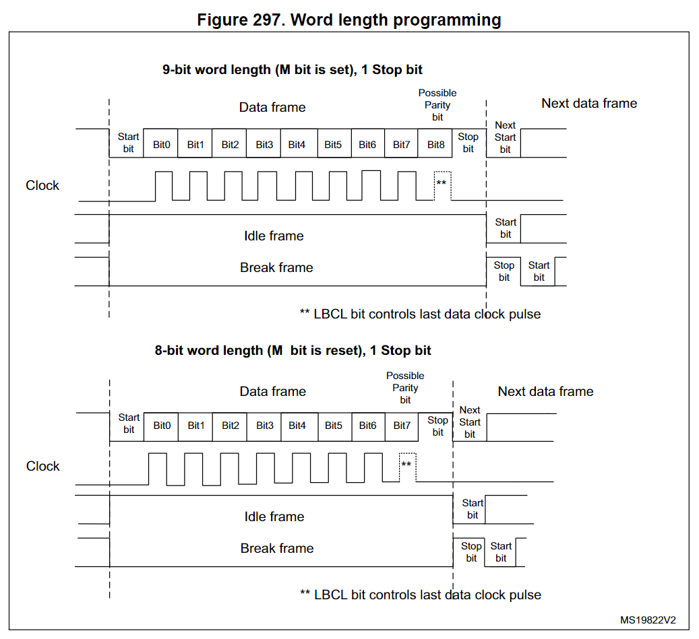
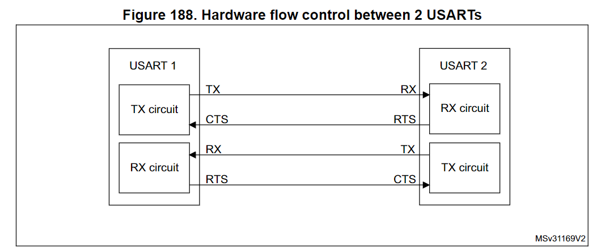
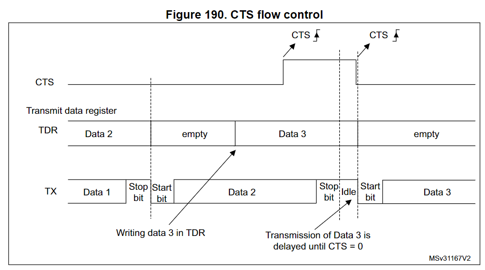

# STM32 USART

Universal synchronous asynchronous receiver transmitter

[Stm32 HAL库 USART(发送+接收)全部采用DMA形式](https://blog.csdn.net/xinghunlove123/article/details/89503218)

[STM32 tutorial: Efficiently receive UART data using DMA](https://stm32f4-discovery.net/2017/07/stm32-tutorial-efficiently-receive-uart-data-using-dma/)

## USART main features

* Full duplex, asynchronous communications
* NRZ standard format (Mark/Space)
* Configurable **oversampling** method by 16 or by 8 to give flexibility between speed and clock tolerance

  * For RX, **Oversampling techniques are used for data recovery by discriminating between valid incoming data and noise**
* Fractional baud rate generator systems

  * Common programmable transmit and receive baud rate (refer to the datasheets for the value of the baud rate at the maximum APB frequency.
* Programmable data word length (8 or 9 bits)
* Configurable stop bits - support for 1 or 2 stop bits （0.5，1.5 ？？）
* LIN Master Synchronous Break send capability and LIN slave break detection capability

  * 13-bit break generation and 10/11 bit break detection when USART is hardware configured for LIN
* Transmitter clock output for synchronous transmission
* IrDA SIR encoder decoder

  * Support for 3/16 bit duration for normal mode
* Smartcard emulation capability

  * The Smartcard interface supports the asynchronous protocol Smartcards as defined in the ISO 7816-3 standards
  * 0.5, 1.5 stop bits for Smartcard operation
* Single-wire half-duplex communication
* Configurable multibuffer communication using DMA (direct memory access)

  * Buffering of received/transmitted bytes in reserved SRAM using centralized DMA
* Separate enable bits for transmitter and receiver
* Transfer detection flags:

  * Receive buffer full
  * Transmit buffer empt
  * End of transmission flags
* Parity control:

  * Transmits parity bit
  * Checks parity of received data byte
* Four error detection flags:

  * Overrun error
  * Noise detection
  * Frame error
  * Parity error
* Ten interrupt sources with flags:

  * CTS changes
  * LIN break detection
  * Transmit data register empty
  * Transmission complete
  * Receive data register full
  * Idle line received
  * Overrun error
  * Framing error
  * Noise error
  * Parity error
* Multiprocessor communication - enter into mute mode if address match does not occur
* Wake up from mute mode (by idle line detection or address mark detection)
* Two receiver wakeup modes: Address bit (MSB, 9th bit), Idle line

## USART functional description

双向通信最少需要TX/RX两根pin

**RX**: Receive Data Input is the serial data input. Oversampling 技术通过**识别有效数据和噪声**来恢复正确的数据

**TX**: Transmit Data Output. transmitter disable的时候，输出pin回到I/O 端口配置状态。 transmitter enable 且空闲的时候，TX pin保持**高电平**

**CK**: Transmitter clock output. 这根pin用于同步传输模式，打 clock

下面两根pin用于硬件流控:

**这两个Pin要互相接，即CTS要接到对面的RTS上，RTS要接到对面的CTS上**

CTS: Clear To Send blocks the data transmission at the end of the current transfer when high

RTS：Request to send indicates that the USART is ready to receive a data (when low).

### USART Block Diagram

## USART character  description

* Word Lenght 可以配置为8 位或者9位

  * USART_CR1.M = 1 -> 9位
  * USART_CR1.M = 0 -> 8位
* TX pin在起始位为低电平，TX pin在停止位为高电平

### Idle character

两个start bit之间一直保持**高电平**，idle frame包含起始位和停止位

For TX: 在第一个data frame之前，设置TE=1，让USART 发送一个idle frame

For RX: 检测到an idle frame 时，和收到数据处理流程一样，只不过如果IDLEIE bit 为1，会多一个中断产生

### Break character

* UART 拉low TX pin发送 break信号（TX FIFO empty, TX idle），RX pin接收检测break 信号
* USART_CR1.M = 0时，break transmission 为10 low bit
* USART_CR1.M = 1时，break transmission 为11 low bit
* For TX:
  * 设置SBK bit = 1，在当前frame 发送完后，TX line 会打出break 信号。
  * 在发完break信号后，SBK bit会由硬件在break 信号的stop bit 期间清除。
  * USART 会在break frame 结束后插入 高电平，以保证下一个frame的start bit能正常被识别。
  * If the software resets the SBK bit before the commencement of break transmission, the break character will not be transmitted. For two consecutive breaks, the SBK bit should be set after the stop bit of the previous break
* For RX ：收到break character时，USART 会把它当作一个 framing error处理

### 为什么 break 信号不会超过10/11 low bits?

怎么理解？停止位不是可以配置的吗？，如果停止位配置为0.5 bit，break 信号该是多少bit，10 bit怎么来的？？？

## Transmitter

TE=1，使能发送，LSB 先发送，内部总线将数据发送到USART_DR寄存器的TDR，TDR再传输到transmit shift register，然后通过TX pin打出数据

在发送期间不能将TE设0，否则破坏TX的数据，波特率计数器停止，当再将TE设1时，此时会发送一个idle frame

### **可配置的停止位:**

* 1 stop bit: This is the default value of number of stop bits.
  * Sampling for 1 stop Bit is done on the 8th, 9th and 10th samples.
* 2 Stop bits: This will be supported by normal USART, single-wire and modem modes.
  * Sampling for 2 stop bits is done on the 8th, 9th and 10th samples of the first stop bit.
  * If a framing error is detected during the first stop bit the framing error flag will be set.
  * The second stop bit is not checked for framing error.
  * The RXNE flag will be set at the end of the first stop bit
* 0.5 stop bit: To be used when receiving data in **Smartcard mode**.
  * No sampling is done for 0.5 stop bit.
  * As a consequence, **no framing error** and **no break frame** can be detected when 0.5 stop bit is selected.
* 1.5 stop bits: To be used when transmitting and receiving data in **Smartcard mode**
  * When transmitting in smartcard mode, the device must check that the data is correctly sent.
  * Thus the receiver block must be enabled (RE =1 in the USART_CR1 register) and the stop bit is checked to test if the smartcard has detected a parity error.
  * In the event of a parity error, the smartcard forces the data signal low during the sampling - NACK signal-, which is flagged as a framing error.
  * Then, the FE flag is set with the RXNE at the end of the 1.5 stop bit.
  * Sampling for 1.5 stop bits is done on the 16th, 17th and 18th samples (1 baud clock period after the beginning of the stop bit).
  * The 1.5 stop bit can be decomposed into 2 parts:
    * one 0.5 baud clock period during which nothing happens,
    * followed by 1 normal stop bit period during which sampling occurs halfway through

#### **停止位位数的选择有什么讲究？**

### 数据发送流程

| sequence | function                                                                                                                                                                                                                        | register         |
| -------- | ------------------------------------------------------------------------------------------------------------------------------------------------------------------------------------------------------------------------------- | ---------------- |
| 1        | 使能 USART                                                                                                                                                                                                                      | USART_CR1.UE = 1 |
| 2        | 定义字长（word length）                                                                                                                                                                                                         | USART_CR1.M      |
| 3        | 设置停止位                                                                                                                                                                                                                      | USART_CR2        |
| 4        | 使能DMA，假如要用multi buffer 通信                                                                                                                                                                                              | USART_CR3        |
| 5        | 设置波特率                                                                                                                                                                                                                      | USART_BRR        |
| 6        | 发送一个idle frame 作为第一笔传输                                                                                                                                                                                               | USART_CR1.TE = 1 |
| 7        | 数据写入USART_DR来发送数据，写USART_DR会清除TXE bit。 Repeat this for each data to be transmitted in case of single buffer                                                                                                 | USART_DR         |
| 8        | 将最后一个数据写入USART_DR后，等待TC=1。它表示最后一个frame 已经传输完成。 **This is required for instance when the USART is disabled or enters  the Halt mode to avoid corrupting the last transmission** | wait until TC=1  |

### Single byte communication

写 USART_DR总是会清除 TXE bit，TXE bit由硬件设1，有如下含义：

* 数已经从TDR 搬到了移位寄存器，数据传输已经开始
* TDR 寄存器为空了
* 下一个数据可以写入USART_DR寄存器，且不会覆盖上次写入的数据

TXEIE = 1，TXE=1 会产生一个中断

当正在传输时，写USART_DR寄存器存入TDR的数据会在当前传输结束后copy到移位寄存器

当没有传输时，写USART_DR寄存器会直接写入移位寄存器， 数据传输开始时，TXE bit 会立即设1

当一个frame传输完成(stop bit结束)，且TXE=1，TC 会被HW 设1，此时如果USART_CR1.TCIE=1就会产生一个中断

当最后一个数据写入USART_DR寄存器后，在disable USART 或者进入low power mode之前，要强制性等待TC=1

### TC bit何时清除呢？

* 读 USART_SR寄存器
* 写 USART_DR 寄存器
* 直接给TC写0，但只推荐在multibuffer 通信时使用

#### 在F1/F2 数据发送后TXE 有短暂拉high，TC为什么不设1？

## Receiver

### Start bit detection

对于oversampling by 16 or by 8，start bit检测序列是相同的

识别到特定的采样序列后，会认为收到了start bit，这个序列是:

1110 X 0X0X0 000

如果序列不完整，start bit 检测会被取消，receiver 回到idle 状态（没有任何flag被设置），继续等待下降沿信号

在后面两次采样中，如果两次采样都满足采样的3个bit都为0，可以确认收到start bit，RXNE 会被设1

在后面两次采样中，如果至少其中一次采样满足3个bit中有2个bit为0，也可以确认收到start bit，RXNE 会被设1，但是NE noise flag 会设1

在后面两次采样中，如果两次采样都不满足3个bit中至少有2个bit为0的条件，那start bit检测取消，回到idle 状态

### Character reception

以LSB 方式接受数据, USART_DR 有一个RDR buffer在内部总线和接收移位寄存器之间

### 数据接收流程

| sequence | function                           | register       |
| -------- | ---------------------------------- | -------------- |
| 1        | 使能USART                          | USART_CR1.UE=1 |
| 2        | 定义字长（word length）            | USART_CR1.M    |
| 3        | 设置停止位                         | USART_CR2      |
| 4        | 使能DMA，假如要用multi buffer 通信 | USART_CR3      |
| 5        | 设置波特率                         | USART_BRR      |
| 6        | 使能receiver，开始检测start bit    | USART_CR1.RE=1 |

#### 收到一个数据时

* RXNE=1, 表示移位寄存器的数据搬到了RDR中，可以读数据和error flags（noise or an overrun flag）了
* RXNEIE=1时，会产生一个中断
* 在multi buffer模式中，在收到每一个byte都会将RXNE设1，DMA 从Data Register 搬走后，RXNE bit会被硬件清除
* 在single buffer 模式中，SW 读USART_DR 会清除RXNE bit，也可以直接对RXNE写0清除。
  * 为避免Overrun error，RXNE bit必须在接收下一个字符结束前被清除
* 在接收数据期间，如果RE bit被清除，当前接收会被abort

### Overrun error

* 当RXNE=1时，又收到数据，会产生overrun error
  * 可能还没人读USART_DR或者之前的DMA请求还没被service到
* 当RXNE=1时，数据不能从接收移位寄存器搬到RDR寄存器，因为RDR寄存器的值还没读走
* 当发生overrun error 时:
  * ORE =1，至少有一个数据丢失，此时有两种情况：
    * RXNE=1, 最后一个有效数据还在RDR，可以读到
    * RXNE=0, 最后一个有效数据已经被读走，已经没有数据在RDR中
      * This case can occur when the last valid data is read in the RDR at the same time as the new (and lost) data is received
      * It may also occur when the new data is received during the reading sequence (between the USART_SR register read access and the USART_DR read access)
  * RDR 内容不会丢失，还可以从USART_DR读到
  * 移位寄存器会被overwritten。
  * （RXNEIE=1） 或者 （EIE=1 和 DMAR bit =1），会产生一个中断
  * 读USART_SR然后读USART_DR，会清除ORE bit

### Selecting the proper oversampling method

根据应用场景来选择合适的oversampling：

* 选择oversampling by 8，USART_CR1.OVER8=1, 可以达到更高的速度(up to Fpclk/8))，这种情况下，receiver 对 clock deviation的容忍性降低
* 选择oversampling by 16，USART_CR1.OVER8=0, 可以增加receiver 对 clock deviation的容忍性，但是最高速限制到 Fpclk/16

start bit detection中，确认逻辑电平的方法选择

* USART_CR3.ONEBIT = 0,  用3个bit来确认逻辑电平，NF noise bit有效
  * 在噪声比较严重的场合下用这种
* USART_CR3.ONEBIT = 1,  用1个bit来确认逻辑电平，NF noise bit无效，被disable
  * 在没啥噪声干扰的场合下用这种，可以增加receiver 对clock deviation的容忍度

#### 当在frame中检测到噪声

* 在RXNE bit的上升沿，HW会将NF设1
* 无效数据从移位寄存器搬到USART_DR寄存器
* No interrupt is generated in case of single byte communication. However this bit rises at the same time as the RXNE bit which itself generates an interrupt. In case of multibuffer communication an interrupt will be issued if the EIE bit is set in the USART_CR3 register.在single byte communication中，没有中断会产生
* 读 USART_SR后再读USART_DR，NF bit会被清零

### Framing error

#### 检测条件

在期望时间内没有检测到停止位，following either a de-synchronization or excessive noise.

#### framing error 检测到时

* HW设置FE=1
* 无效数据从移位寄存器搬到USART_DR寄存器
* No interrupt is generated in case of single byte communication. However this bit rises at the same time as the RXNE bit which itself generates an interrupt. In case of multibuffer communication an interrupt will be issued if the EIE bit is set in the USART_CR3 register

## Multiprocessor communication

## single-wire half-duplex communication

## Continuous communication using DMA

### Transmission using DMA

enable DMA by USART_CR3.DMAT=1

| sequence | function                                                                                                   | register |
| -------- | ---------------------------------------------------------------------------------------------------------- | -------- |
| 1        | 将USART_DR寄存器地址写入DMA控制寄存器，作为传输的目的地址 TXE 产生的时候，DMA会从内存搬数据到USART_DR | USART_DR |
| 2        | 将内存地址写入DMA控制寄存器，作为传输的源地址 TXE 产生的时候，DMA会从这个内存搬数据到USART_DR         |          |
| 3        | 配置数据传输的总长度到DMA控制寄存器                                                                        |          |
| 4        | 在DMA寄存器中配置channel优先级                                                                             |          |
| 5        | Configure DMA interrupt generation after half/ full transfer as required by the application                |          |
| 6        | 通过对TC写0，清除SR 寄存器中的TC bit                                                                       |          |
| 7        | Activate the channel in the DMA register                                                                   |          |

### Reception using DMA

enable DMA by USART_CR3.DMAR=1

The DMAR bit should be cleared by software in the USART_CR3 register during the interrupt subroutine

| sequence | function                                                                                                 | register |
| -------- | -------------------------------------------------------------------------------------------------------- | -------- |
| 1        | 将USART_DR寄存器地址写入DMA控制寄存器，作为传输的源地址 RXNE产生的时候，DMA会从USART_DR搬数据到内存 | USART_DR |
| 2        | 将内存地址写入DMA控制寄存器，作为传输的目的地址 RXNE产生的时候，DMA会从USART_DR搬数据到内存         |          |
| 3        | 配置数据传输的总长度到DMA控制寄存器                                                                      |          |
| 4        | 在DMA寄存器中配置channel优先级                                                                           |          |
| 5        | Configure DMA interrupt generation after half/ full transfer as required by the application              |          |
| 6        | 通过对TC写0，清除SR 寄存器中的TC bit                                                                     |          |
| 7        | Activate the channel in the DMA register                                                                 |          |

## Hardware flow control

Enable RTS, USART_CR3.RTSE = 1

Enable CTS, USART_CR3.CTSE = 1

### RTS flow control

USART receiver准备收数据时，会将RTS 拉low，RX buffer满的时候会将RTS拉high

### CTS flow control

* TX 会检测CTS，如果为low，则发送数据
* CTSE=1时,  CTSIF flag会根据CTS pin状态改变而改变
* Special behavior of break frames:
  * when the CTS flow is enabled, the transmitter does not check the CTS input state to send a break.

