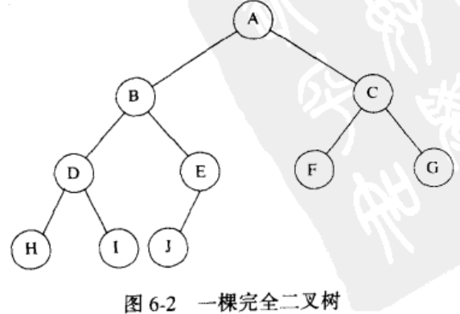
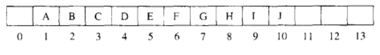
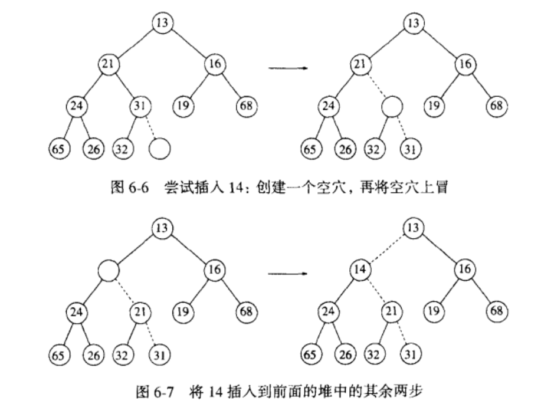
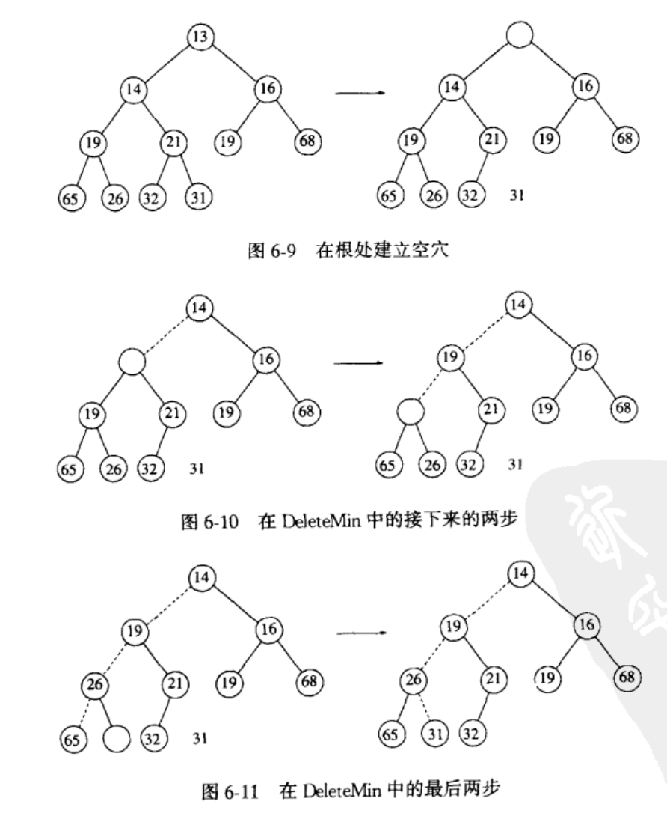

# 优先队列

## 二叉堆（binary heap）

堆是一个被完全填满的二叉树（底层除外），

底层的元素从左到右填入

对于数组中任意i上的元素，其左儿子在位置2i上，右儿子在左儿子后的单元（2i+1）中，它的父亲则在位置i/2上

### 堆序性质(heap order)

使操作可以被快速执行的性质是堆序性。

在一个堆中，对于每一个节点X，X的父亲中的关键字小于（或等于）X中的关键字，根节点除外（它没有父亲）。

### 基本操作

#### 插入（insert）

**上滤（percolate up）策略**

为将一个元素X插入到堆中，我们在下一个空闲位置创建一个空穴，否则该堆将不是完全树。如果X可以放在该空穴中而并不破坏堆的序，那么插入完成。否则，我们把空穴的父节点的元素移入该空穴中，这样，空穴就朝着根的方向上行一步。继续该过程直到X能被放入空穴中为止。

如果要插入的值是最新的最小值，那么它将一直被推向顶端。这样在某一时刻，i将是1，我们需要让程序跳出while循环。我们采用把一个很小的值放在位置0处以使while循环得以终止。这个值必须保证小于（或等于）堆中的任何值。我们称之为标记（sentinel）。这种类似于链表中的头节点，这样避免每个循环都要执行一次测试操作，从而节省时间。

### 删除最小元（DeleteMin）

**下滤（percolate down）策略**

